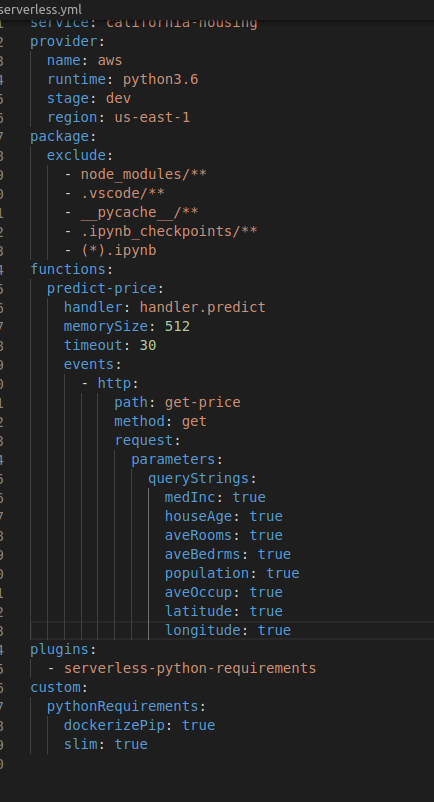

# california-house-prediction-deployment-aws

**Deploying AWS Lambda functions with the serverless framework is arguably the easiest way to deploy functions and configure how they get triggered. If you want to automate your function deployment, you will most likely do so via your CI/CD workflow. A CI/CD pipeline can be implemented in many different ways using a variety of tools (e.g., Jenkins, AWS etc)**

```
Getting started

First install the serverless framework and generate a skeleton for a Python function:
npm install -g serverless
```
1. Set up credentials to the cloud service provider . For eg in case of aws go to IAM role and create a role and note down the **key** and **secret key**

2. Enter the credentials of service provider and connect to using **sls config credentials  --provider aws --key ____  --secret ___**

3. Write the following cmd to initialize the handler.py(Lambda Function) and serverless.yml files **sls create --template aws-python3 --name california-housing**

```
The function is stored in the handler.py file and the manifest describing how to deploy the function and how it gets invoked is serverless.yml.
```


4. Edit the handler.py and serverless.yml 

5. In handler.py we need to load the weights we have created after running **Model Preparation.ipynb**




6. In order to test the handler.py run the file with do_main() function and we can see the output in the terminal


7. To test the lambda function locally run the following command **sls invoke local --function predict-price --path event.json**   where event.json is created in the previous step


8. Finally deploy the model  using sls deploy


9. We can eve test the lambda function that uploaded using **sls invoke global --function predict-price --path event.json**


10. We we wiil sent request in the above mentioned url mentioned in the get method it will predict the house price

Finally..............


